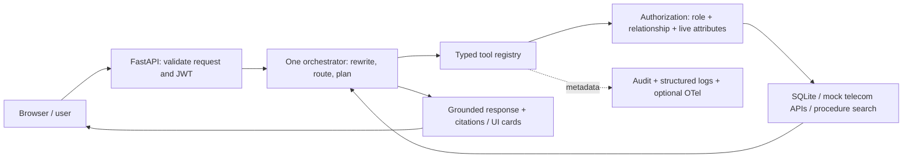

# telecomboard: an authorization-aware telecom agentic assistant

A small Python assistant for synthetic telecom operations. One FastAPI app routes a question to a bounded tool plan, checks access in code, and answers from operational data or cited procedures.

**Start the review with one flow:** Maya, an assigned on-shift technician, can request a Wi-Fi password reveal. Raj, a customer-support agent, can request a reset but cannot see the password. The password travels directly to a short-lived UI card; it never enters the model prompt, chat response, memory, or trace attributes.

## Architecture



Default runtime: **one process, two SQLite files, no cloud account required**. The mock telecom APIs run in process. No Kubernetes, graph server, agent fleet, collector, or separate vector database is needed.

Optional integrations already supported: Gemini/Vertex for intent routing and SQL generation, Permit PDP for external authorization, Neo4j for topology queries, Langfuse via OpenTelemetry. MCP, A2A, and ADK are extension examples; the default request path does not use them.

## Run locally (Windows)

Use Python 3.12+ from the project folder. Existing users can keep their virtual environment.

```powershell
python -m venv .venv
.venv\Scripts\python -m pip install -e ".[dev]"
.venv\Scripts\python -m switchboard.cli --offline --demo serve gateway
```

Open **http://127.0.0.1:8000/**. The app seeds synthetic data on first start. `--offline` ignores cloud credentials. `--demo` explicitly enables persona login and demo controls. Stop with Ctrl+C.

For your existing cloud setup:

```powershell
.venv\Scripts\python -m pip install -e ".[llm,permit,neo4j,otel]"
$env:GOOGLE_API_KEY = "your-key"
powershell -ExecutionPolicy Bypass -File .\start.ps1
```

`start.ps1` loads `.env`, preserves shell values, enables the local demo UI, and starts on localhost. CLI commands also load `.env` unless `--offline` is supplied. **A Gemini key set in the same PowerShell session works without putting it in `.env`.** Never commit keys, `.env`, downloaded credentials, or `.sbdata`. Docker does not make a published secret safe.

`seed` replaces demo data: stop the app first and use it only when you deliberately want a fresh database. Tests always use their own temporary database copies.

## A five-minute demo

| Persona | Ask / action | Expected result |
|---|---|---|
| Maya | “What's the Wi-Fi password at 14 Elm St?” | Reveal card; one redemption succeeds, reuse fails |
| Raj or EXT-T1 | Same question | No password or reveal card; safe refusal |
| Maya | Close WO-1042 in the sidebar; ask again | Denied immediately; reopen after the demo |
| Raj | “Reset the Wi-Fi password for S-88123” | Confirmation card; only the button authorizes that exact write |
| Priya | “Subscribers report no internet at 14 Elm St. What's going on?” | Topology, optical status, cited procedure; no automatic ticket or booking |
| Maya | “How do I replace an ONT?” | Current permitted procedure with section citations |
| Maya | “How many customers in 02139?” | Only her assigned customer, not every customer in that ZIP |
| Maya | “Same customer. Did the fix hold?” after a customer query | Same-session reference resolved; tools authorize again |

The persona selector is **demo authentication**, and the reveal card is a simulated recent-authentication workflow, **not real MFA**. Do not expose this demo publicly. Production needs a real identity provider and verified step-up evidence.

## What the agent actually does

1. Validate message length, nonempty text, JWT signature and audience. Read the user's current role from the directory so old tokens do not preserve revoked privileges.
2. Reject recognized instruction-injection patterns. This heuristic is defense in depth; authorization is the security boundary.
3. Expand telecom abbreviations and resolve an explicit subscriber/address or a previous subject in the same user's session.
4. With Gemini configured, classify the message into one of six validated intents. Otherwise use deterministic patterns. Invalid/unavailable model output falls back to those patterns. `routing_source` in the response shows `gemini` or `rules`.
5. Build a fixed plan of at most six steps. Independent reads may run concurrently. Calls, retry iterations, and scheduling time are bounded. A running Python worker cannot be forcibly killed; upstream timeouts still matter.
6. Validate every tool's input using Pydantic and check the action/resource against the current principal before execution. Data tools recheck individual objects when needed.
7. Format evidence into plain language. Procedure answers are extractive and cited; the model does not invent the final operational answer.
8. Retain the last subject and at most 20 turn summaries. Optionally save cross-session episodes only with `SB_LONG_TERM_MEMORY=1`.

**Where the LLM is useful:** paraphrases such as “The connection at 14 Elm St has gone completely silent” can map to outage diagnosis without a matching keyword. Unsupported structured questions can be translated into SQL. The model never chooses a role, grants itself access, supplies a confirmation, or obtains a password.

To demonstrate model involvement, install `[llm]`, supply the key, ask a paraphrase, and inspect `routing_source` plus the `gen_ai.generate` span. The offline test suite mocks model responses; it does not claim to measure live Gemini quality or spend API credits.

## Authorization and the password flow

- **RBAC:** role grants define broad capabilities (for example, NOC topology read; CSR password reset).
- **Relationships:** an active work-order assignment links the user to a subscriber, which owns a CPE device. Separate device grants are unnecessary.
- **Live context:** reveal requires `on_shift is True`, `device_trust == "managed"` (an enum, not a score/boolean), contractor certification only for contractors, and a finite authentication age in `[0, 300)` seconds.
- **Break glass:** two distinct supervisors create a 15-minute relationship. It still requires the same contextual reveal checks. There is no broad supervisor reveal grant.
- **Document clearance:** ordinal comparison, public < internal < confidential/vendor_nda < restricted.
- **Expiry/revocation:** every local tuple read enforces expiry. Revocation removes local access in the same transaction; the durable outbox retries external synchronization. Permit adds another required decision when configured. A remote failure denies rather than silently allowing.
- **Two secret checks:** creating a 60-second, user-bound reveal reference is a preflight; redemption consumes it atomically and rechecks access with a freshly calculated authentication age. The credential endpoint response has `Cache-Control: no-store`.
- **Confirmation:** reset/reboot confirmation references bind actor, action, arguments, and expiry. Typing “confirmed” or supplying a tool `confirm` argument cannot authorize a write. Redemption is single-use and permissions are checked again.

See [Permit integration](docs/permit-integration.md) for sync and container details. The local policy is a security guard even with Permit enabled; policy changes require regression tests on both implementations.

## RAG, SQL, and memory

**Procedures:** ingest document metadata and heading-based parent/child sections, quarantine an entire poisoned document, index child text with SQLite FTS5 plus local hash vectors, filter classification/model/latest revision before retrieval, combine ranks, then return the surrounding section. No lexical evidence means no answer. Hash vectors are inexpensive lexical features, not a neural semantic embedding service. `/pN` in citations is a section ordinal for these synthetic documents, not a verified PDF page.

**Structured questions:** approved templates or Gemini produce one SELECT over canonical views. `sqlglot` checks tables, columns, functions, and literal limits. Views omit PII/secret columns and scope to exact authorized subscriber IDs; the model cannot widen that scope. The attached source database is read-only, query-only mode is enabled, execution has a progress timeout, and results are capped at 200 rows.

**Memory:** session state is keyed by user and session. It stores subject references and bounded turn metadata, not passwords or full tool output. Optional long-term recall filters `user_id` in SQL, then reauthorizes the referenced subscriber. Expired episodes cannot be recalled even before physical cleanup. A remembered subject is context, never a permission grant.

## Repository tour

| File | Why it exists |
|---|---|
| `src/switchboard/gateway.py` | API, JWT boundary, confirmation/reveal redemption, demo UI |
| `orchestrator.py` | Rewrite, six-intent routing, bounded plans, evidence-based response |
| `tools.py` | One shared registry with input schemas and authorization |
| `auth.py`, `policy.py`, `idg.py` | Synthetic identity, policy checks, relationship changes and outbox sync |
| `reveal.py`, `confirmations.py` | Hashed single-use capability references |
| `text2sql.py`, `ontology.py`, `data/ontology.yaml` | Canonical schema, classification, exact row scope, SQL validation |
| `rag.py`, `memory.py` | Grounded procedures and scoped context |
| `core.py`, `datagen.py`, `legacy.py` | SQLite lifecycle, synthetic data, mock operational services |
| `telemetry.py`, `logging_config.py`, `audit.py` | Scrubbed spans, metadata-only JSON events, hash-chained decisions |
| `llm.py`, `kg.py` | Optional Gemini and topology adapters |
| `mcp_servers.py`, `a2a.py`, `adk_app.py` | Optional protocol/framework examples; not required to run the app |
| `tests/test_regressions.py`, `tests/test_scenarios.py` | Security regression cases and end-to-end flows |
| `evals/run_evals.py`, `evals/datasets/` | Small deterministic evaluation gate and trajectory fixtures |
| `compose.yml`, `Dockerfile` | Single-app container demo |

All abbreviated source filenames above live under `src/switchboard/`.

## Tests and evaluations

```powershell
.venv\Scripts\python -m pytest -q
.venv\Scripts\ruff check src tests evals conftest.py
```

Tests isolate data per case and clear inherited cloud configuration. Optional adapter tests skip if their extras are absent. The full installed environment includes MCP, ADK, and OTel adapter checks.

Coverage includes allowed/denied reveal, one-second-past-expiry tuples, user-bound references, confirmation reuse/expiry, immediate revocation, live attributes, exact SQL scope, invalid SQL, tool failures, malformed input, mocked Gemini routing/fallback, poisoned documents, reingestion, memory scoping, trace regressions, MCP authentication, and A2A receiver authorization.

The evaluation gate is part of pytest (`evals/test_evals.py`). It measures SQL execution agreement, RAG hit@3, classification F1 and a deterministic refusal rubric against small synthetic gold sets. These are regression signals, not representative production accuracy claims. `SB_RUN_GEVAL=1` opts into a separately installed DeepEval judge; no nightly judge or calibration pipeline is claimed.

## Docker

```powershell
docker compose up --build -d
docker compose ps
```

Open http://127.0.0.1:8000/. Stop a host app already using port 8000 first. `docker compose down` stops the app; the named volume preserves data. The container runs as UID 10001 with a writable `/data`; `.dockerignore` excludes keys and local databases.

For existing cloud integrations, start the Permit PDP separately, then use:

```powershell
docker compose --env-file .env -f compose.permit.yml up -d
docker compose -f compose.yml -f compose.cloud.yml up --build -d
```

The override installs the optional packages and passes `.env` at runtime. Permit is reached via `host.docker.internal:7766` from the app container. Shell-only Gemini settings must be explicitly passed into a container; they do not automatically appear inside it. Host `start.ps1` does inherit the shell key. Cloud services can have quotas or charges; offline mode makes no cloud calls.

## Observability

Local trace details show tool trajectory, allow/deny reason codes and a trace ID. JSON operational events include action/tool/status metadata. Raw chat input stays in the local demo debug buffer and is not exported as a span attribute. Secrets are excluded by the reveal architecture and checked by output/state scrubbing. Optional Langfuse receives scrubbed OTel metadata, with the application and OTel trace IDs aligned.

Audit records are append-only through SQLite triggers and linked by hashes. This detects ordinary tampering; a database administrator could rewrite a whole chain. A production system would send audit events to a separate protected store. Rate limits, task buffers, and caches are local to one process.

## Mapping to the JD

| Area | Demonstrated implementation | Why this scope |
|---|---|---|
| Agent orchestration / tool calling | One router, fixed plans, typed guarded tools | Reviewable and predictable |
| Query rewriting / memory | Abbreviations, subject references, bounded session state | Natural follow-up questions |
| RAG / SQL | Cited current procedures and scoped SELECTs | Separate text evidence from structured facts |
| Identity / authorization | JWT + roles + assignment + live context + secret references | Code enforces access even if model is wrong |
| Logging / Langfuse / OTel | JSON events, traces, audit | Explain what ran and why it was denied |
| Evaluations / DeepEval | Offline regression gate; optional GEval adapter | Repeatable checks before paid judges |
| Docker / Python | Nonroot single-app image, Pydantic, isolated tests | Simple to reproduce |
| Gemini / Vertex | `google-genai` adapter | Optional language understanding |
| MCP / A2A / ADK | Guarded extension examples | Useful only for external clients or agents |
| Kubernetes / GCP hosting | Future deployment decision | No infrastructure added without a scaling need |

## Review notes and limits

This is an interview-quality prototype using synthetic data, not a production credential service. Before real deployment: replace the demo identity provider and simulated MFA, protect management routes, define tenant ownership for global readers, move encryption/signing keys to a secret manager, use HTTPS, add durable distributed rate limits and audit storage, and test production data scale. Model routing is constrained but still needs a larger real-language evaluation set. Optional Neo4j import is idempotent for current records but does not delete stale graph data.

[Review changes and verification](docs/review-results.md) · [Five-minute demo guide](GUIDE.md) · [Design decisions](docs/ADR.md) · [Neo4j/Langfuse](docs/neo4j-langfuse.md)

## Manual GitHub upload

Use the checked source ZIP described in [the upload guide](docs/github-upload.md). Browser uploads do not apply .gitignore automatically. Keep the original .env local. A focused secret check is available with `.venv\Scripts\python scripts/check_secrets.py`. The beginner PDF is in `output/pdf/`; its editable builder is `scripts/build_interview_guide.py` (requires reportlab).

If configured Permit is unavailable, startup reports how to restore the PDP. Start Docker Desktop before the Permit Compose command. To deliberately use local adapters instead, `start.ps1 -Offline` is available. Expected-refusal examples S2/S4 appear in the Blocked scenarios panel. See the latest live checks in `docs/review-results.md`.
